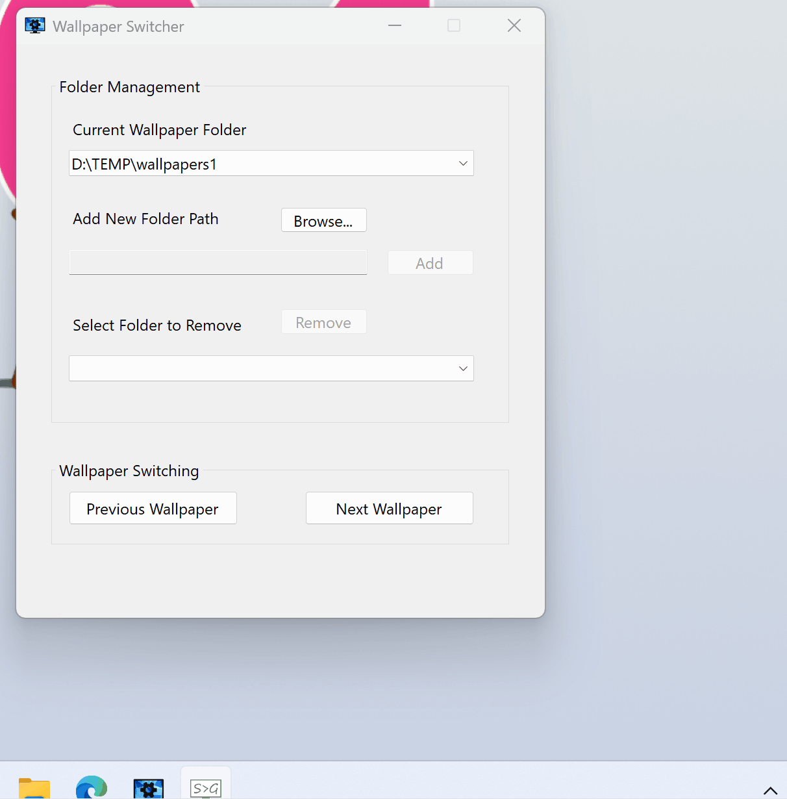

# Wallpaper Switcher

**Wallpaper Switcher** is a lightweight and user-friendly wallpaper manager for Windows. It allows users to manage multiple wallpaper folders and quickly switch between images with ease.

## Features 

- [x] **Folder Management:** 
  - Add new wallpaper folders
  - Remove existing wallpaper folders
  - Switch between wallpaper folders
- [x] **Manual Wallpaper Switching:** 
  - Switch to the next wallpaper
  - Switch to the previous wallpaper
- [ ] **Global Hotkey Support**
  - Hotkey for "Next Wallpaper"
  - Hotkey for "Previous Wallpaper"
  - Hotkey for switching wallpaper folders
- [ ] **Dedicated Settings Interface**
  - Manage hotkey configuration
  - Configure auto-start on boot
- [x] **System Tray Integration**
  - Minimize to system tray
  - Right-click menu with options: Open, Exit
- [ ] **Auto Start on Boot**
  - Option to launch automatically when Windows starts
- [ ] **Automatic Wallpaper Switching**
  - Change wallpaper at user-defined intervals
- [ ] **Real-Time Folder Monitoring**
  - Automatically detect changes in wallpaper folders
- [ ] **Startup Optimization**
  - Reduce application launch time

## Installation & Usage

You can run **Wallpaper Switcher** without needing to install anything. Just download the executable file and launch it:

### Download

1. Visit the [Releases](https://github.com/lorenzoyang/WallpaperSwitcher/releases) page on GitHub.
2. Download the latest version of `WallpaperSwitcher.exe`.
3. (Optional) Move the file to a convenient location on your computer, such as your Desktop or a dedicated folder like `C:\Programs\WallpaperSwitcher`.

### Run

- **Double-click** `WallpaperSwitcher.exe` to launch the application.
- A desktop window will appear. You can click the close button in the upper right corner, and the window will disappear. The program will continue running in the system tray.
- You need to exit the program by selecting the "Exit" option in the system tray.

## License

[GPL-3.0](LICENSE)
