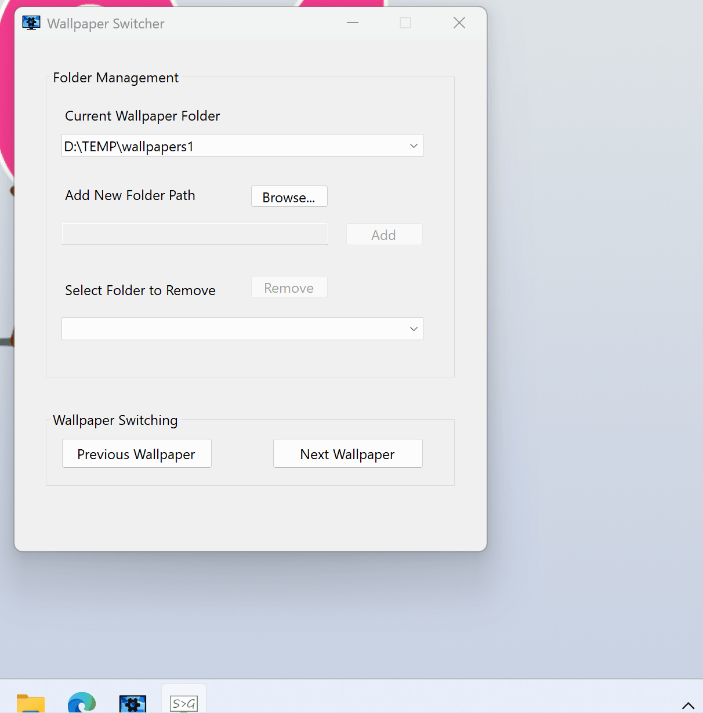

🌐 [English](README.md) | 🇨🇳 [中文](README.zh-CN.md)

# Wallpaper Switcher

**Wallpaper Switcher** is a lightweight, portable wallpaper manager for Windows. It lets you keep multiple wallpaper folders, switch folders quickly, jump to the next wallpaper with a button or global hotkey, and keep the app running quietly from the system tray.


## Features

- **Wallpaper folder management**
  - Add and remove wallpaper folders
  - Switch between configured folders from the main window or tray menu
- **Manual wallpaper switching**
  - Switch to the next wallpaper instantly
  - Use the default global hotkey `Ctrl + Alt + N`, or customize it in Settings
- **Two switching modes**
  - **Native Mode (System SlideShow):** uses Windows' built-in wallpaper slideshow feature
  - **Custom Mode (Fast Switching):** cycles through images directly with the Windows wallpaper API for faster manual switching
- **System tray integration**

  

  - Closing the main window with the **X** button minimizes the app to the tray
  - Right-click the tray icon to switch folders, show the next wallpaper, open Settings, or exit
  - Left-click the tray icon to reopen the main window
- **Global hotkeys**
  - Hotkey for **Next Wallpaper**
  - Hotkey for switching wallpaper folders
  - Validation prevents duplicate or unsupported key combinations
- **Optional startup launch**
  - Enable or disable **Launch at startup** from Settings
- **Settings window**

  

  - Configure hotkeys, startup behavior, and wallpaper switching mode
  - Check whether a newer GitHub release is available

## System Requirements

- Windows desktop environment
- x64 Windows build
- No separate .NET installation is required for the published release builds

## Installation

Wallpaper Switcher is portable and does not need a traditional installer. Choose one of the release packages below.

### Option 1: Single Executable

1. Download `WallpaperSwitcher.exe` from the [Releases](https://github.com/lorenzoyang/WallpaperSwitcher/releases) page.
2. Save it to any folder, such as Desktop or `C:\Programs`.
3. Double-click `WallpaperSwitcher.exe` to run.

> **Note:** The first launch may be slightly slower because the single-file app needs to prepare itself.

### Option 2: Full Package

1. Download `WallpaperSwitcher.zip` from the [Releases](https://github.com/lorenzoyang/WallpaperSwitcher/releases) page.
2. Extract it to a folder, such as `C:\Programs\WallpaperSwitcher`.
3. Open the extracted folder, go to `bin`, and run `WallpaperSwitcher.exe`.

> **Important:** Do not move or delete files inside the `bin` folder. In the full package, `WallpaperSwitcher.exe` must stay inside `bin` to work correctly.

## Updating

Settings and hotkeys are stored outside the app folder, so updating normally does not erase your data.

1. Exit Wallpaper Switcher completely from the tray menu.
2. Replace the old `WallpaperSwitcher.exe` or extracted package files with the new release.
3. Launch the app again.

You can use **Settings** > **Check for Updates** to see whether a newer GitHub release is available. If an update exists, Wallpaper Switcher can open the release page for you.

If you moved the executable to a new folder and enabled **Launch at startup**, disable and re-enable that option in **Settings** so Windows stores the new executable path.

## Basic Usage

- Launch the app by double-clicking `WallpaperSwitcher.exe`.
- Add one or more folders that contain wallpaper images.
- Choose a folder and switching mode.
- Use **Next Wallpaper**, the tray menu, or your configured hotkey to switch wallpapers.
- To create a shortcut, right-click `WallpaperSwitcher.exe`, choose **Create shortcut**, then move the shortcut to Desktop or pin it to Start.

When you close the main window with the **X** button, Wallpaper Switcher keeps running in the system tray. To exit completely, right-click the tray icon and choose **Exit**.

## Switching Modes

Wallpaper Switcher provides two modes because Windows' native slideshow behavior and direct wallpaper setting behave differently.

- **Native Mode (System SlideShow)** asks Windows to manage the slideshow for the selected folder. This mode follows Windows' own slideshow behavior.
- **Custom Mode (Fast Switching)** builds an ordered list of images in the selected folder and sets the next image directly when you switch.

### Known Limitation: Multi-Monitor Setups

Wallpaper Switcher does not currently provide consistent multi-monitor support.

- In **Native Mode**, using **Next Wallpaper** may advance the wallpaper on only one monitor, depending on how Windows handles the native slideshow.
- In **Custom Mode**, switching sets the same next wallpaper across the desktop, so multiple monitors usually change in sync.

There is no per-monitor wallpaper selection or unified multi-monitor behavior in the current version.

## User Data

All user data is stored in:

```text
C:\Users\<YourUsername>\AppData\Local\WallpaperSwitcher
```

This folder contains:

- `settings.json`: wallpaper folders, last selected folder, selected switching mode, tray hint state, and startup preference
- `hotkeys.json`: custom global hotkey mappings

This path is fixed for each Windows user account, so future app updates can reuse the same settings even if the executable is replaced or moved.

## Resetting the App

To reset Wallpaper Switcher to its default state:

1. Exit the app from the tray menu.
2. Delete the user data folder:

   ```text
   C:\Users\<YourUsername>\AppData\Local\WallpaperSwitcher
   ```

3. If needed, remove the startup entry:
   - Press `Win + R`, type `regedit`, and press Enter
   - Open:

     ```text
     HKEY_CURRENT_USER\Software\Microsoft\Windows\CurrentVersion\Run
     ```

   - Delete the `WallpaperSwitcher` entry

For smaller changes, use **Settings** to update startup behavior or remove individual hotkey bindings without deleting all user data.

## Removing the App

Wallpaper Switcher is portable and does not install system-wide files. To remove it:

1. Exit the app completely from the tray menu.
2. Delete the app files:
   - Single executable: delete `WallpaperSwitcher.exe`
   - Full package: delete the extracted `WallpaperSwitcher` folder
3. Remove any shortcuts you created from Desktop, Start, or the taskbar.
4. If **Launch at startup** was enabled, turn it off in **Settings** before deleting the app, or remove the registry entry shown above.
5. Optionally delete the user data folder if you do not want to keep settings for a future reinstall.

## Hotkey Format

- Default hotkey: `Ctrl + Alt + N` for **Next Wallpaper**
- Hotkeys can be changed in **Settings**
- Use `+` as the separator; spaces and letter case are ignored
- A hotkey must include at least one modifier and one letter key
- Only one letter key from `A` to `Z` is supported
- Duplicate modifiers are rejected
- Bare keys, `None`, numeric key codes, and unsupported keys are rejected

Supported modifiers:

- `Ctrl`
- `Control` as an alias for `Ctrl`
- `Alt`
- `Shift`
- `Win`
- `Windows` as an alias for `Win`

Valid examples:

- `Ctrl + Alt + N`
- `Ctrl + Shift + N`
- `Ctrl + Alt + Shift + N`
- `Control + Windows + N`

## Development

This project includes GitHub Actions for validation and release publishing:

- Pull requests and pushes to `main` run formatting, Release build, and tests.
- Pushing a version tag such as `v1.1.0` builds release artifacts and creates a GitHub Release.

## License

[GPL-3.0](LICENSE)
