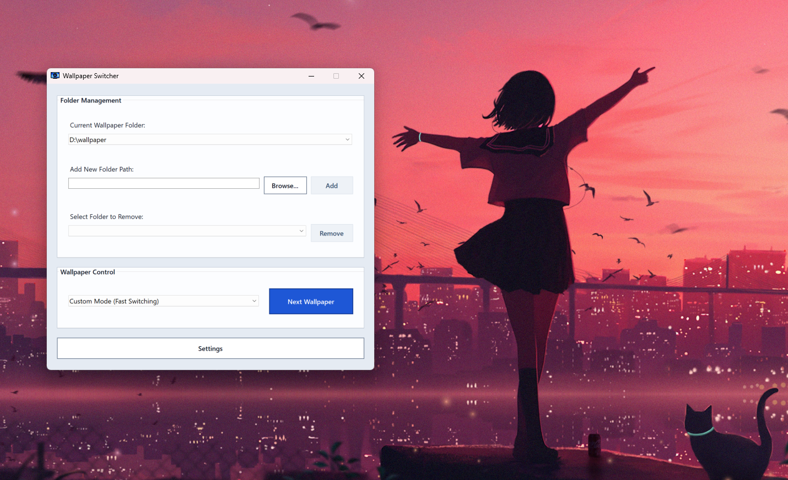
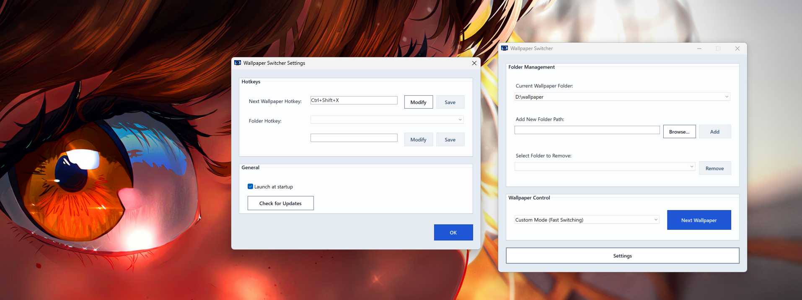

🌐 [English](README.md) | 🇨🇳 [中文](README.zh-CN.md)

# 壁纸切换器 (Wallpaper Switcher)

**壁纸切换器**是一款轻量级、便携式 Windows 壁纸管理工具。你可以添加多个壁纸文件夹，快速切换文件夹或下一张壁纸，并通过全局快捷键、系统托盘和设置窗口完成常用操作。

## 界面截图

### 主界面



### 设置界面



## 功能特性

- **壁纸文件夹管理**
  - 添加和移除壁纸文件夹
  - 可从主窗口或托盘菜单快速切换文件夹
- **手动切换壁纸**
  - 立即切换到下一张壁纸
  - 默认快捷键为 `Ctrl + Alt + N`，也可在设置中修改
- **两种切换模式**
  - **原生模式（系统幻灯片）：** 使用 Windows 内置壁纸幻灯片功能
  - **自定义模式（快速切换）：** 直接调用 Windows 壁纸 API 循环切换图片，手动切换速度更快
- **系统托盘集成**
  - 点击窗口 **X** 关闭按钮时，程序会最小化到系统托盘
  - 右键托盘图标可切换文件夹、切换下一张壁纸、打开设置或退出程序
  - 左键托盘图标可重新打开主窗口
- **全局快捷键**
  - 支持 **下一张壁纸** 快捷键
  - 支持切换壁纸文件夹快捷键
  - 会校验重复或不受支持的快捷键组合
- **可选开机自启**
  - 可在设置中开启或关闭 **开机自启**
- **设置窗口**
  - 配置快捷键、开机自启和壁纸切换模式
  - 检查 GitHub 上是否有新版本发布

## 系统要求

- Windows 桌面环境
- x64 Windows 系统
- 发布版已自包含运行时，无需另外安装 .NET

## 安装方式

Wallpaper Switcher 是便携版软件，不需要传统安装程序。你可以选择以下任一发布包。

### 方案 1：单文件版

1. 从[发布页面](https://github.com/lorenzoyang/WallpaperSwitcher/releases)下载 `WallpaperSwitcher.exe`
2. 保存到任意目录，例如桌面或 `C:\Programs`
3. 双击 `WallpaperSwitcher.exe` 运行

> **注意：** 单文件版首次启动可能稍慢，因为程序需要先完成自准备过程。

### 方案 2：完整包

1. 从[发布页面](https://github.com/lorenzoyang/WallpaperSwitcher/releases)下载 `WallpaperSwitcher.zip`
2. 解压到目标目录，例如 `C:\Programs\WallpaperSwitcher`
3. 打开解压后的文件夹，进入 `bin` 目录并运行 `WallpaperSwitcher.exe`

> **重要：** 请勿移动或删除 `bin` 目录中的文件。完整包中的 `WallpaperSwitcher.exe` 必须保留在 `bin` 目录内才能正常运行。

## 更新到新版本

设置和快捷键不会保存在程序目录中，所以正常更新不会清除你的数据。

1. 从托盘菜单完全退出 Wallpaper Switcher
2. 用新版 `WallpaperSwitcher.exe` 或新版完整包文件替换旧文件
3. 重新启动程序

你可以在 **设置** 中点击 **Check for Updates** 检查 GitHub 上是否有新版本。如果存在更新，Wallpaper Switcher 可以帮你打开对应的发布页面。

如果你把程序移动到了新目录，并且启用了 **开机自启**，请在 **设置** 中先关闭再重新开启该选项，让 Windows 记录新的程序路径。

## 基本使用

- 双击 `WallpaperSwitcher.exe` 启动程序
- 添加一个或多个包含壁纸图片的文件夹
- 选择要使用的文件夹和切换模式
- 通过 **下一张壁纸** 按钮、托盘菜单或快捷键切换壁纸
- 如需创建快捷方式，右键 `WallpaperSwitcher.exe`，选择 **创建快捷方式**，然后移动到桌面或固定到开始菜单

点击窗口 **X** 关闭按钮时，Wallpaper Switcher 会继续在系统托盘运行。如需完全退出，请右键托盘图标并选择 **退出**。

## 切换模式说明

Wallpaper Switcher 提供两种模式，是因为 Windows 原生幻灯片和直接设置壁纸的行为并不完全相同。

- **原生模式（系统幻灯片）** 会把选中的文件夹交给 Windows 原生壁纸幻灯片功能管理，行为取决于 Windows 自身实现。
- **自定义模式（快速切换）** 会按文件名顺序生成图片列表，并在切换时直接设置下一张图片。

### 已知限制：多屏幕环境

Wallpaper Switcher 当前不提供一致的多屏幕支持。

- 在 **原生模式** 下，使用 **下一张壁纸** 时可能只会切换其中一个屏幕的壁纸，具体行为取决于 Windows 原生幻灯片。
- 在 **自定义模式** 下，切换时会把同一张下一张壁纸设置到桌面，因此多个屏幕通常会同步变化。

当前版本不支持按屏幕单独选择壁纸，也不保证两种模式在多屏幕环境下行为一致。

## 用户数据

所有用户数据保存在：

```text
C:\Users\<用户名>\AppData\Local\WallpaperSwitcher
```

该目录包含：

- `settings.json`：保存壁纸文件夹、上次选择的文件夹、切换模式、托盘提示状态和开机自启偏好
- `hotkeys.json`：保存自定义全局快捷键

这个路径对每个 Windows 用户账号都是固定的，所以后续更新或移动程序文件时，应用仍会读取同一份设置。

## 重置程序

如需将 Wallpaper Switcher 恢复到默认状态：

1. 从托盘菜单完全退出程序
2. 删除用户数据文件夹：

   ```text
   C:\Users\<用户名>\AppData\Local\WallpaperSwitcher
   ```

3. 如有需要，移除开机启动项：
   - 按 `Win + R`，输入 `regedit` 并回车
   - 打开：

     ```text
     HKEY_CURRENT_USER\Software\Microsoft\Windows\CurrentVersion\Run
     ```

   - 删除 `WallpaperSwitcher` 键值

如果只是进行较小调整，可以通过 **设置** 窗口修改开机自启状态或移除单个快捷键绑定，无需删除全部用户数据。

## 删除/卸载程序

Wallpaper Switcher 是便携版软件，不会安装系统级文件。如需删除：

1. 从托盘菜单完全退出程序
2. 删除程序文件：
   - 单文件版：删除 `WallpaperSwitcher.exe`
   - 完整包：删除解压出来的 `WallpaperSwitcher` 文件夹
3. 删除你创建的快捷方式，例如桌面、开始菜单或任务栏中的快捷方式
4. 如果启用了 **开机自启**，请在删除程序前先到 **设置** 中关闭，或删除上文提到的注册表启动项
5. 如果不想为后续重新安装保留设置，可选删除用户数据文件夹

## 快捷键格式

- 默认快捷键：`Ctrl + Alt + N`，用于 **下一张壁纸**
- 可在 **设置** 中修改快捷键
- 使用 `+` 作为分隔符；空格和大小写会被忽略
- 快捷键必须包含至少一个修饰键和一个字母键
- 仅支持 `A` 到 `Z` 中的单个字母键
- 不允许重复修饰键
- 不接受单独字母键、`None`、数字键码或不受支持的按键

支持的修饰键：

- `Ctrl`
- `Control`，等同于 `Ctrl`
- `Alt`
- `Shift`
- `Win`
- `Windows`，等同于 `Win`

有效示例：

- `Ctrl + Alt + N`
- `Ctrl + Shift + N`
- `Ctrl + Alt + Shift + N`
- `Control + Windows + N`

## 开发与发布

本项目包含 GitHub Actions，用于日常检查和发布：

- Pull Request 和推送到 `main` 时会运行格式检查、Release 构建和测试
- 推送版本标签，例如 `v1.1.0`，会构建发布产物并创建 GitHub Release

## 开源许可

[GPL-3.0](LICENSE)
